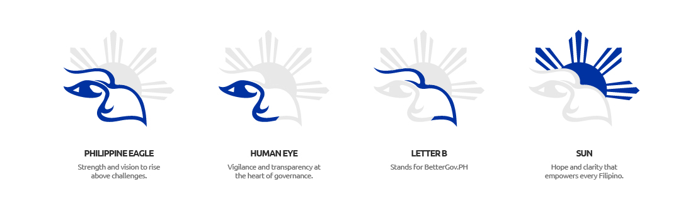

# BetterGov.PH Full Logo Suite
## Design Breakdown

###
- ✅ Always use the provided logo files directly from this repository.  
- ✅ Choose the most appropriate orientation (horizontal, stacked, or icon) for your application.  
- ❌ Do not alter, modify, stretch, or distort the logo in any way.  
- ❌ Do not change the colors, proportions, or typography.  
- ❌ Do not add effects such as shadows, gradients, or outlines.
## Horizontal Logo
<table>
  <tr>
    <th>Logo Preview</th>
    <th>Download SVG</th>
    <th>Download PNG</th>
    <th>Download EPS</th>
  </tr>
  <tr>
    <td></td>
    <td></td>
    <td></td>
    <td></td>
  </tr>
  <tr>
    <td></td>
    <td></td>
    <td></td>
    <td></td>
  </tr>
  <tr>
    <td></td>
    <td></td>
    <td></td>
    <td></td>
  </tr>
  <tr>
    <td></td>
    <td></td>
    <td></td>
    <td></td>
  </tr>
</table>

## Vertical Logo
<table>
  <tr>
    <th>Logo Preview</th>
    <th>Download SVG</th>
    <th>Download PNG</th>
    <th>Download EPS</th>
  </tr>
  <tr>
    <td></td>
    <td></td>
    <td></td>
    <td></td>
  </tr>
  <tr>
    <td></td>
    <td></td>
    <td></td>
    <td></td>
  </tr>
  <tr>
    <td></td>
    <td></td>
    <td></td>
    <td></td>
  </tr>
    <tr>
    <td></td>
    <td></td>
    <td></td>
    <td></td>
  </tr>
</table>

## Icon Logo
<table>
  <tr>
    <th>Logo Preview</th>
    <th>Download SVG</th>
    <th>Download PNG</th>
    <th>Download EPS</th>
  </tr>
  <tr>
    <td></td>
    <td></td>
    <td></td>
    <td></td>
  </tr>
  <tr>
    <td></td>
    <td></td>
    <td></td>
    <td></td>
  </tr>
  <tr>
    <td></td>
    <td></td>
    <td></td>
    <td></td>
  </tr>
   <tr>
    <td></td>
    <td></td>
    <td></td>
    <td></td>
  </tr>
</table>

## Emblem Logo
<table>
  <tr>
    <th>Logo Preview</th>
    <th>Download SVG</th>
    <th>Download PNG</th>
    <th>Download EPS</th>
  </tr>
  <tr>
    <td></td>
    <td></td>
    <td></td>
    <td></td>
  </tr>
  <tr>
    <td></td>
    <td></td>
    <td></td>
    <td></td>
  </tr>
  <tr>
    <td></td>
    <td></td>
    <td></td>
    <td></td>
  </tr>
  <tr>
    <td></td>
    <td></td>
    <td></td>
    <td></td>
  </tr>
</table>
